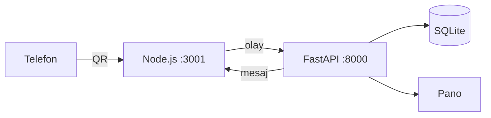

<p align="center">
  
  
  
  
  
</p>

<h1 align="center">TLLH-WA</h1>

<p align="center">
  WhatsApp sohbetlerini kendi bilgisayarında tutan küçük bir köprü.<br>
  Kaynak kodu açık, üzerine ekleyerek geliştirilebilir.
</p>

QR ile bir kez bağlanıyorsun. Sonra gelen ve giden mesajlar, silinen mesajlar, bir kez görülen fotoğraf ve videolar makinede kalıyor. Tarayıcıdan da bakılabiliyor.

Repoda hesap, anahtar ya da sohbet yok. Bunlar çalıştırdığın klasörde oluşuyor. `.gitignore` yüzünden git’e de girmiyorlar.

Bitmiş bir uygulama değil. İki ana dosya var, gerisi onları ayağa kaldırıyor. İstediğin yeri değiştirip devam edebilirsin.

## Ne yapıyor

- QR ile bağlanıyor, kopunca tekrar deniyor. Çevrimiçi görünmüyor.
- Mesajları `tllh_data.db` dosyasına yazıyor.
- Son mesajları bellekte tutuyor. Biri mesaj silerse eldeki kopyayı `deleted_msgs` tablosuna alıyor.
- Bir kez görülen fotoğraf ve videoyu `arsiv/tek_seferlik` altına indiriyor.
- `http://127.0.0.1:8000` adresinde sohbetleri, mesajları ve arşivi gösteriyor.
- Kendi sohbetine yazılan `.lock`, `.unlock`, `.start` ve `.stop` komutlarını okuyor.

Yapay zeka, otomatik cevap ya da özet yok. Bu repoda o kod bulunmuyor.

## Nasıl bağlı



İki terminal lazım. Node WhatsApp tarafı, Python kayıt ve pano. İkisi de sadece `127.0.0.1` üzerinden konuşuyor.

## Çalıştırma

Windows, Node.js 18+, Python 3.11+.

```bat
copy .env.example .env
```

Portları değiştirmeyeceksen dosyayı açmana gerek yok.

Önce Python:

```bat
start_python.bat
```

İlk açılışta sanal ortamı kuruyor, tabloları oluşturuyor, sonra panoyu başlatıyor.

Sonra Node:

```bat
start_node.bat
```

Paketler inince terminalde QR çıkar. Telefonda Bağlı cihazlar’dan okut. Pano: http://127.0.0.1:8000

Python kapalıysa Node gelen olayı kaydedemiyor. Bağlantı durmuyor, sadece o olay boşa gidiyor.

Betik kullanmadan:

```bat
python -m venv venv_new
venv_new\Scripts\python.exe -m pip install -r requirements.txt
venv_new\Scripts\python.exe db_setup.py
venv_new\Scripts\python.exe tllh_whatsapp.py
```

```bat
npm install
node tllh_whatsapp.js
```

## Komutlar

Sadece kendi numaranla açtığın sohbette çalışıyor. Grupta yazınca bir şey olmuyor.

| Komut | Ne oluyor |
| --- | --- |
| `.unlock` | Genel kilit açılıyor |
| `.lock` | Genel kilit kapanıyor |
| `.start` | Kilit açıkken bu sohbet etkin listeye giriyor |
| `.stop` | Sohbet listeden çıkıyor |

Bu listeye bakarak kendi cevabını ekleyebilirsin. Şu an bu komutlardan sonra otomatik mesaj gitmiyor.

## Dosyalar

| Dosya | Ne işe yarıyor |
| --- | --- |
| `tllh_whatsapp.js` | Oturum, olaylar, indirme, 3001 portu |
| `tllh_whatsapp.py` | Kayıt, pano, 8000 portu |
| `db_setup.py` | Tablolar |
| `templates/dashboard.html` | Pano sayfası |
| `.env.example` | Port ve klasör yolları |

Tablolar: `messages`, `deleted_msgs`, `view_once_media`, `permissions`, `settings`, `contacts`.

Yeni bir olay eklemek için Node tarafında `postToPython` çağır, Python tarafında aynı adrese bir webhook yaz.

```text
POST http://127.0.0.1:8000/webhook/message
POST http://127.0.0.1:8000/webhook/deleted
POST http://127.0.0.1:8000/webhook/view_once
POST http://127.0.0.1:8000/webhook/contact_update
POST http://127.0.0.1:8000/command

POST http://127.0.0.1:3001/send_message
{ "jid": "...", "text": "..." }
```

## Repoya girmeyenler

`.env`, `auth_state/`, `tllh_data.db`, `arsiv/`, `cache/`, `venv_new/`, `node_modules/`.

`auth_state` WhatsApp oturumun. Veritabanı da sohbetlerin. Bunları commit etme, zip’e koyma.

Panoda ve Node API’sinde şifre yok. `DASHBOARD_HOST` değerini `127.0.0.1` dışında bir adrese alma.
